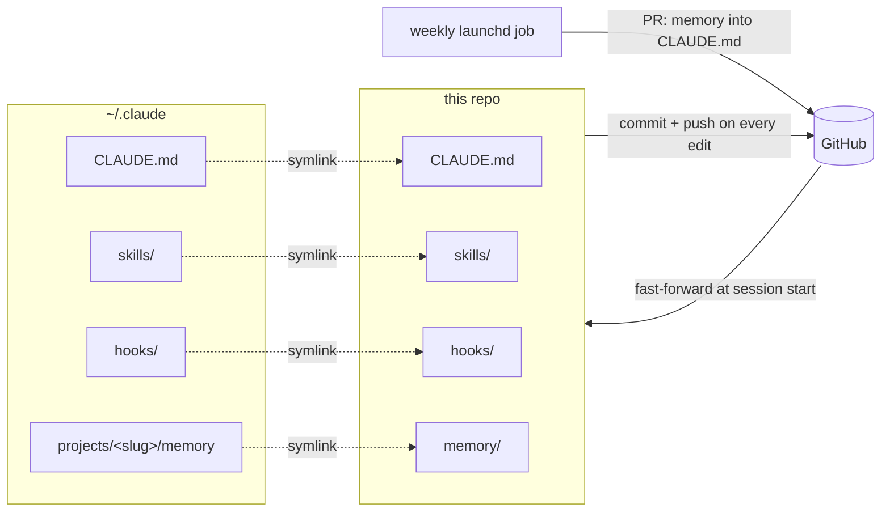

# claude-config-template

A starting point for keeping your [Claude Code](https://docs.claude.com/en/docs/claude-code) configuration
in git. Your global `CLAUDE.md`, your skills, your hooks and your auto-memory live in this repository.
`~/.claude` only holds symlinks into it. Every change Claude makes to its own configuration is
committed and pushed right away, and a weekly job opens a pull request that folds recurring memories
into `CLAUDE.md`.



## What is in here

| Path | Purpose |
|---|---|
| `CLAUDE.md` | Global instructions. Ships with one section: commit and push every change to this repo |
| `skills/self-improve-skill/` | A skill for writing skills: baseline-tested, small files, a self-improvement section in each |
| `hooks/commit-config-repo.sh` | `PostToolUse` hook: reminds Claude to commit and push after it edits this repo |
| `scripts/sync-config.sh` | `SessionStart` hook: fast-forwards the checkout from origin |
| `memory/` | Claude Code's auto-memory for your main working directory |
| `scripts/consolidate-memory.sh` | Weekly job: reconciles `memory/` with `CLAUDE.md` and opens a PR |
| `launchd/claude-memory-consolidation.plist.template` | macOS schedule for that job |
| `local.env.example` | Machine-specific settings, copied to the git-ignored `local.env` |

`~/.claude/settings.json` stays out of the repo on purpose: its `env` block often holds API tokens.

## Requirements

`git`, `zsh`, `jq`, the `claude` CLI, and for the weekly job the GitHub CLI `gh` (`gh auth login`).
Pushing must work without a prompt (an SSH key or a credential helper).

## 1. Create your copy

Click **Use this template** on GitHub, preferably as a **private** repository since it will collect
your memories. Then clone it. The rest of this README uses `$REPO` for the checkout:

```sh
REPO=~/claude-config
git clone git@github.com:<you>/<your-repo>.git "$REPO"
```

Pick the directory you usually start `claude` in. Claude Code keeps that directory's memory under
`~/.claude/projects/<slug>/memory`, where the slug is the absolute path with every character other
than a letter or digit replaced by `-` (`/Users/you/work` becomes `-Users-you-work`):

```sh
WORKDIR=~/work
MEMORY_LINK=~/.claude/projects/$(cd "$WORKDIR" && pwd | sed 's|[^A-Za-z0-9]|-|g')/memory
```

## 2. Bring in your existing configuration

Skip this section on a machine with no `~/.claude` content yet.

Back everything up first. `-L` copies what a symlink points to, so this also works if parts are
already linked somewhere else:

```sh
BACKUP=~/.claude-backup-$(date +%Y%m%d%H%M%S)
mkdir -p "$BACKUP"
for p in CLAUDE.md skills hooks; do
  [ -e ~/.claude/$p ] && cp -RL ~/.claude/$p "$BACKUP/"
done
[ -e "$MEMORY_LINK" ] && cp -RL "$MEMORY_LINK" "$BACKUP/memory"
ls -la "$BACKUP"
```

Copy your skills in next to `self-improve-skill`. A name that already exists is reported, never overwritten:

```sh
for d in "$BACKUP"/skills/*/; do
  [ -d "$d" ] || continue
  n=$(basename "$d")
  if [ -e "$REPO/skills/$n" ]; then echo "already in the repo, compare by hand: $n"
  else cp -R "$d" "$REPO/skills/$n"; fi
done
```

Hooks and memory, again without overwriting. Your own `MEMORY.md` replaces the stub, and gets the
stub's header line only if it has no equivalent:

```sh
for f in "$BACKUP"/hooks/*; do
  [ -e "$f" ] || continue
  n=$(basename "$f")
  if [ -e "$REPO/hooks/$n" ]; then echo "already in the repo, compare by hand: hooks/$n"
  else cp -R "$f" "$REPO/hooks/$n"; fi
done
if [ -d "$BACKUP/memory" ]; then
  header=$(head -1 "$REPO/memory/MEMORY.md")
  cp -R "$BACKUP/memory/." "$REPO/memory/"
  if ! grep -qi 'global preferences' "$REPO/memory/MEMORY.md"; then
    { printf '%s\n\n' "$header"; cat "$REPO/memory/MEMORY.md"; } > "$REPO/memory/MEMORY.md.new"
    mv "$REPO/memory/MEMORY.md.new" "$REPO/memory/MEMORY.md"
  fi
fi
```

Your `CLAUDE.md` replaces the template's. The template's **Agent configuration repo** section is
appended to it, unless your file already has that section:

```sh
if [ -f "$BACKUP/CLAUDE.md" ]; then
  if grep -q '^## Agent configuration repo' "$BACKUP/CLAUDE.md"; then
    echo "CLAUDE.md already has the Agent configuration repo section, kept as is"
    cp "$BACKUP/CLAUDE.md" "$REPO/CLAUDE.md"
  else
    { cat "$BACKUP/CLAUDE.md"; echo; sed -n '/^## Agent configuration repo/,$p' "$REPO/CLAUDE.md"; } > "$REPO/CLAUDE.md.new"
    mv "$REPO/CLAUDE.md.new" "$REPO/CLAUDE.md"
  fi
fi
```

Review `git -C "$REPO" status`, then commit and push:

```sh
git -C "$REPO" add -A
git -C "$REPO" commit -m "chore: import existing Claude Code configuration"
git -C "$REPO" push
```

## 3. Link `~/.claude` to the repo

This deletes the originals, so run it only after the backup in section 2 (or on a machine that had
none):

```sh
mkdir -p ~/.claude "$(dirname "$MEMORY_LINK")"
rm -rf ~/.claude/CLAUDE.md ~/.claude/skills ~/.claude/hooks "$MEMORY_LINK"
ln -s "$REPO/CLAUDE.md" ~/.claude/CLAUDE.md
ln -s "$REPO/skills"    ~/.claude/skills
ln -s "$REPO/hooks"     ~/.claude/hooks
ln -s "$REPO/memory"    "$MEMORY_LINK"
printf 'MEMORY_LINK="%s"\nCONSOLIDATION_MODEL=opus\n' "$MEMORY_LINK" > "$REPO/local.env"
ls -la ~/.claude "$MEMORY_LINK"
```

## 4. Register the hooks

Adds the two hooks to `~/.claude/settings.json`, keeping everything already in it:

```sh
SETTINGS=~/.claude/settings.json
[ -f "$SETTINGS" ] || echo '{}' > "$SETTINGS"
jq --arg sync "/bin/zsh $REPO/scripts/sync-config.sh" \
   --arg nudge "/bin/zsh $REPO/hooks/commit-config-repo.sh" '
  .hooks.SessionStart += [{hooks: [{type: "command", command: $sync}]}]
  | .hooks.PostToolUse += [{matcher: "Write|Edit", hooks: [{type: "command", command: $nudge, timeout: 15}]}]
' "$SETTINGS" > "$SETTINGS.new" && mv "$SETTINGS.new" "$SETTINGS"
```

Start a new `claude` session and run `/hooks` to confirm both are listed. `sync-config.sh` logs to
`~/Library/Logs/claude-config/sync.log`.

## 5. Weekly memory consolidation

`scripts/consolidate-memory.sh` runs `claude -p` over `memory/` and `CLAUDE.md` in five passes:
promote memories that apply to every project into `CLAUDE.md`, flag contradictions, propose pruning
memories that record their own resolution, keep `MEMORY.md` in step with the files, and keep the
index header true. When anything changed it pushes a `memory-consolidation/<date>` branch and opens a
pull request for you to review. Nothing reaches `main` until you merge it. If the run fails it opens
a GitHub issue instead. It also re-creates any of the four symlinks that an editor's atomic save
replaced with a regular file.

On macOS, schedule it with launchd (Mondays at 01:00; edit `StartCalendarInterval` to change that,
and `com.example` to your own reverse-DNS prefix if you like):

```sh
mkdir -p ~/Library/LaunchAgents ~/Library/Logs/claude-memory-consolidation
PLIST=~/Library/LaunchAgents/com.example.claude-memory-consolidation.plist
sed -e "s|__REPO__|$REPO|g" -e "s|__HOME__|$HOME|g" \
  "$REPO/launchd/claude-memory-consolidation.plist.template" > "$PLIST"
plutil -lint "$PLIST"
launchctl bootstrap gui/$(id -u) "$PLIST"
launchctl print gui/$(id -u)/com.example.claude-memory-consolidation | head -20
```

Run it once by hand to check it end to end, then read the log:

```sh
launchctl kickstart gui/$(id -u)/com.example.claude-memory-consolidation
tail -f ~/Library/Logs/claude-memory-consolidation/$(date +%F).log
```

A job missed while the machine slept runs at the next wake. To remove it:
`launchctl bootout gui/$(id -u)/com.example.claude-memory-consolidation`.

On Linux, use cron instead (`crontab -e`):

```
0 1 * * 1 /bin/zsh $HOME/claude-config/scripts/consolidate-memory.sh
```

## 6. Every change is committed and pushed immediately

The **Agent configuration repo** section of `CLAUDE.md` tells Claude that edits to its own
configuration are committed and pushed straight away, without asking. `hooks/commit-config-repo.sh`
backs that up: after every `Write` or `Edit` whose target resolves into this repo, it reminds Claude
that the tree is dirty. At the next session start, `sync-config.sh` fast-forwards from origin, so
other machines and merged consolidation PRs arrive on their own. It never pulls over modified
tracked files, which is why uncommitted edits should not be left lying around.

You can do the same by hand from any directory:

```sh
git -C "$REPO" add -A && git -C "$REPO" commit -m "docs: <what changed>" && git -C "$REPO" push
```

## Adding skills

Ask Claude for `/self-improve-skill <what it should do>`, or `/self-improve-skill skill:<name> <the change>` to change
an existing one. New skills land in `~/.claude/skills/<name>/`, which is this repo.
